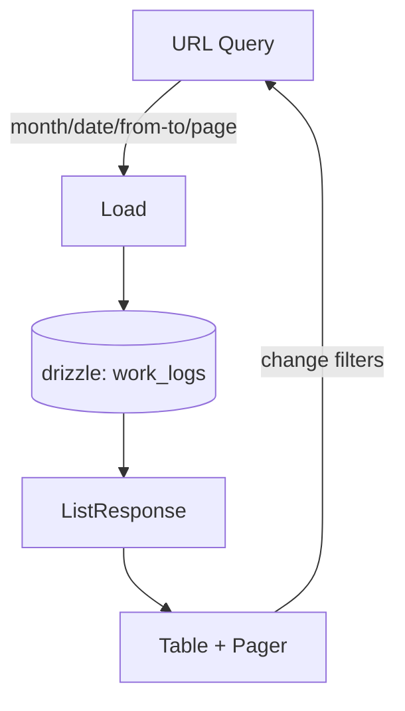

# F-005/F-006: 作業一覧表示と絞り込み 仕様

最終更新: 2025-10-25T00:00:00Z（更新: 合計は月次に限定）

- F-005: 作業一覧の表示（降順）
- F-006: 日付・タグでの絞り込み（MVPは日付／期間を提供。タグは F-003 実装後に有効化）

## 目的・ゴール

- 記録の確認・見返しをストレスなく行える（読み込みが速く、スクロールが軽い）
- 指定日/期間の記録を素早く抽出できる（URL共有可能なクエリ）
- 将来の「内容/タグ」実装と自然に統合できる拡張性

## 用語

- 作業記録（WorkLog）: startedAt〜endedAt の1区間
- フィルタ期間: `from`/`to` で指定する日付範囲（両端含む、UTC基準）

## スコープ（MVP）

- 表示カラム: 日付、開始、終了、作業時間（HH:mm）
  - 内容/タグのカラムは将来追加（現時点では非表示またはダッシュ表示）
- 並び順: `startedAt` 降順固定
- フィルタ: 単一日付（`date=YYYY-MM-DD`）または期間（`from`/`to`）
- ページング: 1ページ 20件（変更可能）。次/前へ移動

非MVP（後続）

- タグ絞り込み（F-003 実装後に有効化）
- 無限スクロール（初期はページリンク）
- 高度な並び替え（昇順、endedAt、作業時間など）

## 画面要素（想定）

- フィルタバー
  - 日付指定（単一） or 期間指定（From/To）
  - クイック: 今日/今週/今月（任意。MVPでは Today/This Month だけでも可）
  - タグ入力（将来: トークン入力 + サジェスト。MVPでは非表示）
  - クリアボタン（フィルタ解除）
- 一覧テーブル（またはリスト）
  - 列: 日付（yyyy-MM-dd）、開始（HH:mm）、終了（HH:mm または `—`）、作業時間（終了時のみ）
  - 行クリックで編集（F-004 実装時）
- フッター
  - ページネーション（前/次）
  - 集計（指定月の合計; 請求用途のため最優先。任意期間の合計は対象外）

## データモデル（既存/参考）

- DB: work_logs(id, user_id, started_at timestamptz, ended_at timestamptz null, created_at, updated_at)
- ドメイン: `WorkLog { id, userId, startedAt:Date, endedAt:Date|null, ... }`

## クエリ仕様（URL）

- `?month=YYYY-MM` 指定月の一覧（UTC基準で月初〜翌月初に展開）
- `?date=YYYY-MM-DD` 単一日付の抽出（UTC基準の日付範囲に展開）
- `?from=YYYY-MM-DD&to=YYYY-MM-DD` 期間抽出（両端含む、UTC 00:00:00〜23:59:59.999）
- `?page=1&size=20`
- 予約: `?tags=dev,meeting`（F-003 後に有効化）

優先順位: `month` が最優先 → `date` → `from/to`。`size` は 10〜100 の範囲でバリデーション

## サーバー処理（SvelteKit）

Server Load 例（新規 or 既存ページの拡張）

- 入力: userId（locals）、クエリ: { date? | from?/to?, page=1, size=20, tags? }
- 振る舞い:
  - 認証必須。本人の work_logs のみ
  - 期間に展開 → DB 検索（userId + started_at 範囲、tags は将来）
  - 降順に並べ、`limit size + 1` 件取得して `hasNext` を判定
- 出力:
  ```ts
  type ListResponse = {
  	items: Array<{
  		id: string;
  		startedAt: string; // ISO
  		endedAt: string | null; // ISO
  		durationSec: number | null;
  	}>;
  	page: number;
  	size: number;
  	hasNext: boolean;
  	serverNow: string; // ISO
  	// 月次集計: 指定月（month=YYYY-MM。未指定は今月）に対する総作業秒数（ページングに依存しない）
  	monthlyTotalSec: number;
  	// 予約: totalCount, summaryByDay など
  };
  ```

DB アクセス層（drizzle）

- `listWorkLogs(userId, { from?:Date, to?:Date, limit:number, offset:number /* 初期はオフセット */ })`
- 将来 Keyset Pagination （`startedAt < cursorStartedAt or (== and id < cursorId)`）へ移行可能な設計にする

## バリデーション/ルール

- 認証: 401 未認証
- 範囲: `from <= to`、未来日は許容（閲覧目的のため）
- サイズ: 10〜100 以外は最小/最大に丸める
- 並び: `startedAt desc` 固定（不正値は無視）

### 月次合計（請求向け）

- 集計対象は「終了済み（endedAt != null）」のみ。
- 対象月の範囲で寄与時間をクリップして加算する。
  - 例) month=2025-10 → from=2025-10-01T00:00:00.000Z, toExclusive=2025-11-01T00:00:00.000Z
  - 寄与時間 = max(0, min(endedAt, toExclusive) - max(startedAt, from))
- 進行中（endedAt=null）は合計に含めない（請求確定値のため）。

## UI/UX 挙動

- 初期表示: 今月（`from`=月初, `to`=月末）をデフォルト（または直近 N 件）
- フィルタ変更: URL クエリ反映 → 自動リロード（ブラウザ戻る/共有に強い）
- ローディング: スケルトン行を表示。エラー時は短いメッセージ
- タイムゾーン: 表示はローカル時刻、保存/クエリはサーバー（UTC）
- アクセシビリティ: テーブルに `scope=col`、ページャはボタン + aria-label、キーボード操作可能

### 合計表示（指定月）

- フッター右側に「この月の合計: HH:mm」を表示（month=YYYY-MM が基準、未指定は今月）。
- 合計はページングと独立（全件に対する合計）。
- フォーマットはゼロ詰め（例: 07:05）。

## 集計仕様（月次合計）

目的: 指定月（または今月）の作業時間合計を、ページングに依存せず高速に返す。

入力（サーバー側）

- userId（認証済み）
- month: YYYY-MM
- from: Date（UTC, 含む）= 月初 00:00Z（month から導出）
- toExclusive: Date（UTC, 含まない）= 翌月初 00:00Z

定義（1レコードの寄与時間）

```
contribSec = max(0, seconds( min(endedAt, toExclusive) - max(startedAt, from) ))
```

集計クエリ（SQLイメージ）

```sql
SELECT COALESCE(SUM(
  EXTRACT(EPOCH FROM (
    LEAST(ended_at,   $toExclusive)
    - GREATEST(started_at, $from)
  ))
), 0) AS total_sec
FROM work_logs
WHERE user_id = $userId
  AND ended_at IS NOT NULL
  AND started_at < $toExclusive
  AND ended_at   > $from;
```

drizzle 実装方針

- 専用の集計関数 `aggregateMonthlyWorkLogDuration(userId, { month })` を追加（内部で from/toExclusive を算出）。
- ユーザー×期間の条件にインデックス `(user_id, started_at desc)` を活用。
- 返却値は `number`（秒）。UIで HH:mm に整形。

## 受け入れ基準（Acceptance Criteria）

- AC-1: デフォルト表示で最新の作業が先頭に 20 件表示される
- AC-2: `?date=YYYY-MM-DD` で当日分のみ表示される（UTC での当日範囲）
- AC-3: `?from=YYYY-MM-DD&to=YYYY-MM-DD` で期間内のみ表示される
- AC-4: `?page=2` で次の 20 件が表示され、前ページに戻れる
- AC-5: 未終了（進行中）レコードは終了列が `—`、作業時間は空欄/`—`
- AC-6: 未認証時は 401（サインインを促す）
- AC-7: 異常系（`from>to`/不正日付）は 400 にならず、サニタイズして安全な既定値で表示（例: 今月）
- AC-8: 指定月（未指定は今月）の合計時間がフッターに HH:mm で表示され、ページングに関係なく全件の合計である
- AC-9: 月境界を跨ぐレコードは境界でクリップして集計される（開始が前月/終了が翌月でも、対象月内のみ加算）
- AC-10: 進行中（endedAt=null）のレコードは合計に含まれない（請求確定値のため）

## テスト観点

ユニット（Vitest）

- 期間展開ユーティリティ: `date` -> `[from,to]`、境界（うるう年・月跨ぎ）
- 並び順が `startedAt desc` であること
- durationSec の算出（null/正常）
  \- 月次合計の算出ユーティリティ（クリップの境界: 月初/翌月初、うるう年、UTC基準）
  \- 進行中レコードが合計から除外されること
  \- ページングに依存せず合計が一定であること（page=1 と page=2 で合計が変わらない）

コンポーネント（Testing Library for Svelte）

- フィルタ UI の双方向（URL ↔ コントロール）
- テーブル表示（未終了の表記、日付/時間フォーマット）
- ページングの有効/無効制御

E2E（Playwright）

- デフォルト一覧 → 日付指定 → 期間指定 → ページングの一連操作
- URL 直叩き（共有リンク）が意図通りの結果を表示
- フッターに合計が表示され、月変更で正しく更新される（今月→前月→翌月）

## 実装メモ

- DB インデックス: `(user_id, started_at desc)` でクエリ最適化
- 初期は offset/limit。データ増加時に keyset へ移行
- 表示カラムのフォーマットはユーティリティ関数へ（テストしやすく）
- タグは F-003 で `work_log_tags`（中間テーブル）を想定。API 形だけ先に定義しておく

## 将来の拡張

- グルーピング表示（日毎見出し + 折りたたみ）
- 合計/日別集計（F-008 連携）
- タグチップ表示・クリックでフィルタ追加


